# NYC Agent 技术方案报告

## 1. 项目概述

NYC Agent 是一个面向纽约租房与居住决策的多 Agent 智能问答系统。用户可以用自然语言询问某个区域的房租、安全、便利设施、娱乐设施、通勤、天气等问题，系统会自动识别意图、补全上下文、解析区域，并调用不同领域 Agent 查询真实数据库或外部 API，最终生成结构化且可解释的回答。

项目核心目标不是做一个普通聊天机器人，而是构建一个具备以下能力的 Agent 系统：

- 理解用户自然语言中的租房/区域/通勤/生活设施需求。
- 通过 RAG 将模糊地名解析为数据库中的标准 NTA 区域 ID。
- 使用 LangGraph 管理多轮对话状态、缺槽追问和工具调用路径。
- 使用 python-a2a 实现 Agent-to-Agent 通信。
- 使用 MCP 工具服务隔离数据库/API 访问，保证只读 SQL 和工具安全。
- 使用 PostgreSQL/PostGIS 管理区域、犯罪、设施、租金、交通等结构化数据。
- 支持 Docker Compose 一键启动完整后端服务集群。

---

## 2. 系统解决的问题

用户在纽约租房时通常需要综合判断多个维度：

| 需求 | 示例问题 | 系统能力 |
|---|---|---|
| 租金 | “华尔街附近 1b1b 房租多少？” | 查询租金聚合和房源数据 |
| 安全 | “这附近犯罪情况如何？” | 查询 NYPD 犯罪数据和风险指标 |
| 便利 | “那有什么便利设施？” | 查询学校、公园、医疗、图书馆等设施 |
| 娱乐 | “附近有什么娱乐设施？” | 查询餐厅、酒吧、影院、剧院等 POI |
| 通勤 | “从这个区去 NYU 多久？” | 解析起终点并调用交通工具服务 |
| 天气 | “今天会下雨吗？” | 调用天气 MCP/API |
| 多轮上下文 | “那便利设施呢？” | 继承上一轮区域和用户 profile |

系统重点在于：用户不需要每次说完整条件，Agent 可以结合会话状态和 profile 自动补全上下文。

---

## 3. 技术栈

| 层级 | 技术 | 作用 |
|---|---|---|
| 编排层 | LangGraph | Orchestrator Agent 的状态机和多节点流程 |
| LLM 调用 | LangChain / langchain-openai | 调用 GPT 模型进行意图识别、SQL 规划、回答生成 |
| A2A 通信 | python-a2a | Agent 与 Agent 之间标准消息通信 |
| 工具协议 | FastMCP / MCP-style tools | 将数据库/API 封装为工具服务 |
| API 服务 | FastAPI / Flask | Gateway 和 MCP 服务用 FastAPI，Agent 服务用 Flask/python-a2a |
| 数据库 | PostgreSQL 16 + PostGIS | 存储区域、点位、犯罪、租金、地图图层等数据 |
| 缓存 | Redis | 实时交通、天气等短期缓存 |
| RAG | OpenAI Embeddings + 内存向量检索 | 区域名、交通端点、犯罪类别解析 |
| 部署 | Docker Compose | 一键启动 17 个后端容器 |

---

## 4. 总体架构

系统采用“前端 + API Gateway + Orchestrator Agent + 多领域 Agent + MCP 工具服务 + 数据层”的分层架构。

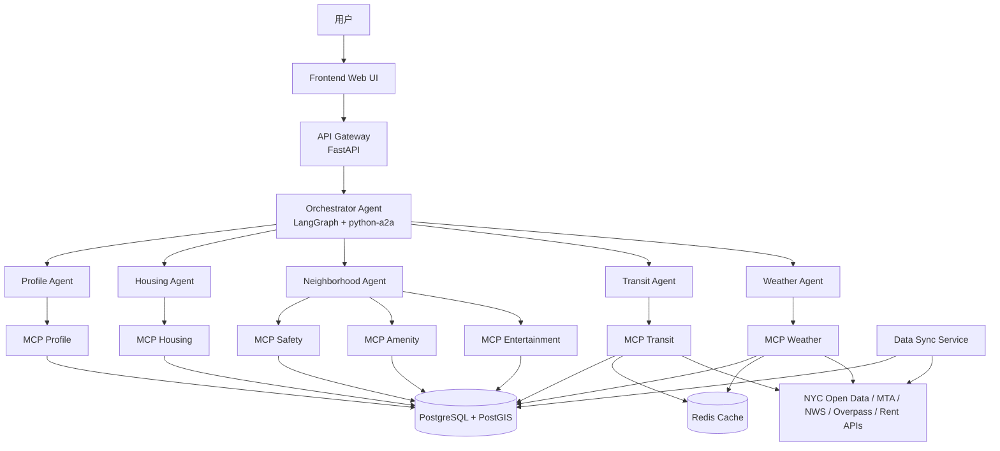

架构分层说明：

- API Gateway 只做请求入口、会话接口和前端适配，不直接访问数据库。
- Orchestrator Agent 是系统大脑，负责理解、路由、追问、聚合结果。
- 领域 Agent 负责某个业务域，例如租金、安全、通勤、天气。
- MCP 服务负责实际访问数据库或外部 API，并进行 SQL 安全校验。
- PostgreSQL/PostGIS 是统一业务数据底座。

---

## 5. 服务拓扑

当前 Docker Compose 启动后主要包含以下服务：

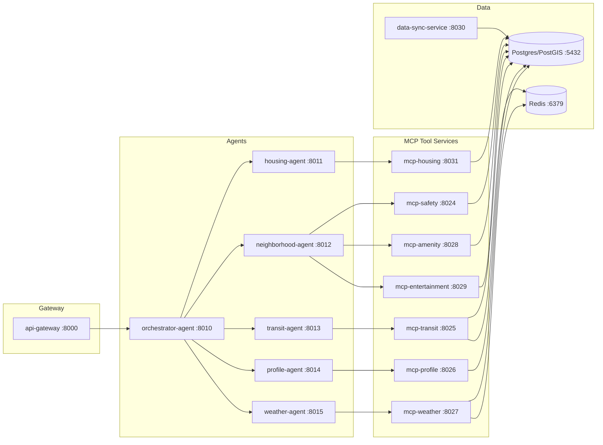

---

## 6. Orchestrator Agent 设计

Orchestrator Agent 使用 LangGraph 实现有状态工作流。它不是简单 if/else，而是一个由多个节点组成的状态机。

### 6.1 LangGraph 节点流程

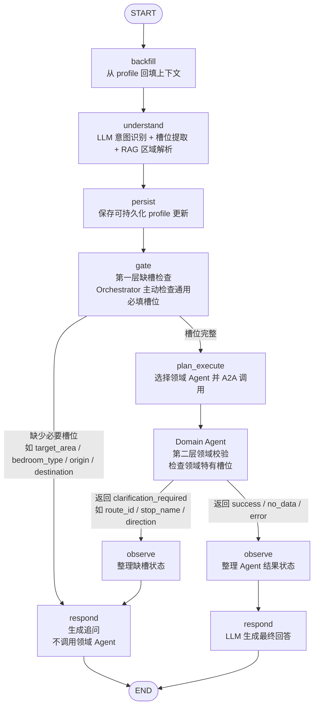

缺槽检测采用双层机制：

- 第一层由 Orchestrator 的 `gate` 节点完成。它根据 intent 检查通用必填槽位，例如租金/安全/便利查询需要 `target_area`，通勤查询需要 `origin` 和 `destination`。如果缺槽，系统直接追问，不会发起无效的 A2A 调用。
- 第二层由领域 Agent 完成。即使 Orchestrator 漏掉了某些领域特有字段，下游 Agent 也可以返回 `clarification_required` 和 `missing_slots`，再由 Orchestrator 的 `observe/respond` 统一转成用户可读的追问。
- 这种设计既减少无效工具调用，也让领域 Agent 保持独立健壮。

### 6.2 各节点职责

| 节点 | 作用 |
|---|---|
| backfill | 从 profile-agent 获取当前 session 的目标区域、偏好等上下文 |
| understand | 使用 LLM 识别 intent、detected_areas、constraints，并触发 RAG |
| persist | 将预算、户型、偏好等稳定信息写入 profile |
| gate | 判断是否缺少 target_area、bedroom_type、origin/destination 等必要槽位 |
| plan_execute | 根据 intent 选择 housing/neighborhood/transit/weather/profile agent |
| observe | 将下游 Agent 结果整理为 success/no_data/error 等状态 |
| respond | 生成自然语言回答，或在缺槽时生成追问 |

---

## 7. 一次问答的完整调用链

以用户提问“这附近的犯罪情况如何”为例，假设 profile 中已有目标区域 `MN0101 / Financial District-Battery Park City`。

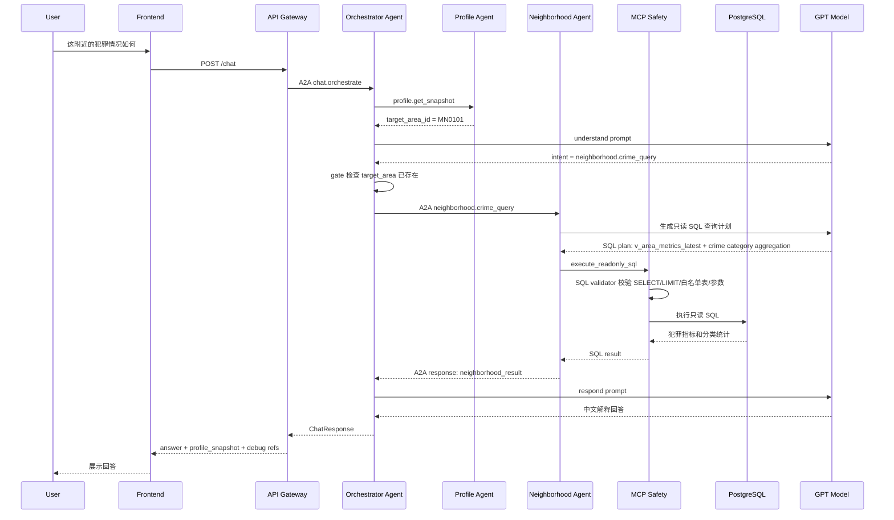

---

## 8. 多 Agent 协作模型

系统将不同能力拆给不同 Agent，避免一个大模型提示词承担所有职责。

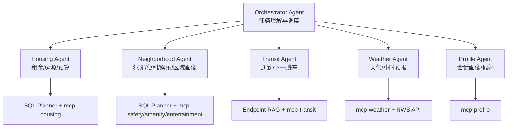

每个 Agent 的边界：

| Agent | 输入 | 输出 | 是否直接访问数据库 |
|---|---|---|---|
| Orchestrator | 用户消息、session state | 调度计划、最终回答 | 否 |
| Housing Agent | area、bedroom、budget | 租金/房源结果 | 否，通过 MCP |
| Neighborhood Agent | area、crime/amenity/entertainment intent | 区域安全/设施结果 | 否，通过 MCP |
| Transit Agent | origin/destination/mode | 通勤/发车信息 | 否，通过 MCP |
| Weather Agent | area/time | 天气结果 | 否，通过 MCP/API |
| Profile Agent | session/profile updates | profile snapshot | 否，通过 MCP |

---

## 9. A2A 通信设计

Agent 之间使用 `python-a2a` 传递标准 `Message`。项目在 `shared/nyc_agent_shared/a2a_protocol.py` 中封装了统一消息格式。

A2A 通信采用“请求描述任务，响应返回任务状态”的模式：

- Request Message：由 Orchestrator 发给领域 Agent，表示“请执行某个 task_type”。
- Response Message：由领域 Agent 返回给 Orchestrator，表示“这个 task 的执行状态和结果”。

### 9.1 请求结构

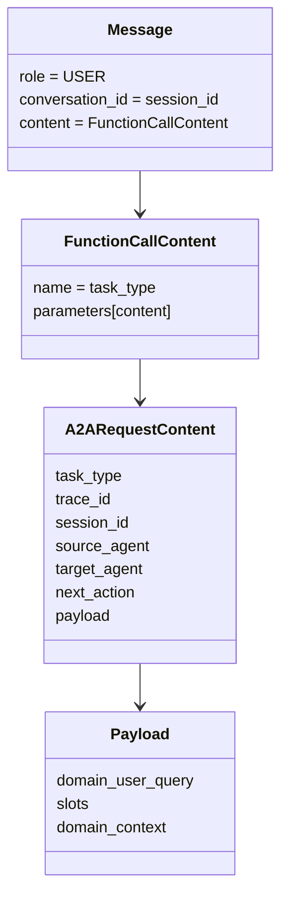

请求中的核心字段：

| 字段 | 含义 |
|---|---|
| `task_type` | 要执行的任务类型，例如 `neighborhood.crime_query` |
| `trace_id` | 一次请求链路的追踪 ID |
| `session_id` | 会话 ID，用于关联上下文 |
| `source_agent` | 调用方，例如 `orchestrator-agent` |
| `target_agent` | 被调用方，例如 `neighborhood-agent` |
| `next_action` | 当前固定为 `call_agent`，表示这是一次 Agent 调用 |
| `payload` | 业务参数，包含用户原始问题、槽位和领域上下文 |

典型请求内容：

```json
{
  "task_type": "neighborhood.crime_query",
  "trace_id": "trace_xxx",
  "session_id": "sess_xxx",
  "source_agent": "orchestrator-agent",
  "target_agent": "neighborhood-agent",
  "next_action": "call_agent",
  "payload": {
    "domain_user_query": "这附近的犯罪情况如何",
    "slots": {
      "area_id": { "value": "MN0101", "source": "session_memory" },
      "area_name": { "value": "Financial District-Battery Park City" }
    },
    "domain_context": {
      "window_days": 30,
      "point_limit": 20
    }
  }
}
```

### 9.2 响应结构

领域 Agent 执行完成后，会返回 `FunctionResponseContent`。状态不放在 request payload 中，而是放在 response 的 `status` 字段。

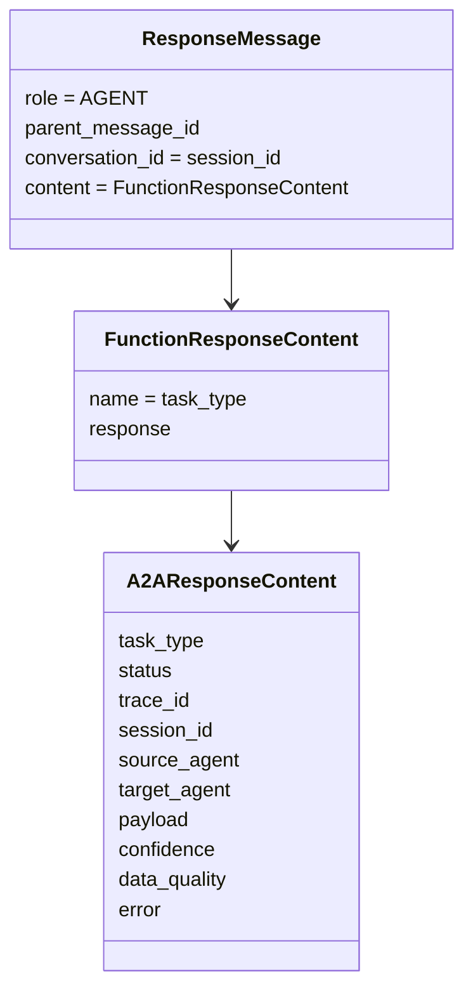

响应中的核心字段：

| 字段 | 含义 |
|---|---|
| `status` | 任务执行结果状态 |
| `payload` | 领域 Agent 返回的结构化结果，例如 SQL plan、executions、derived_metrics |
| `error` | 错误对象，包含 `code/message/retryable` |
| `confidence` | 可选置信度信息 |
| `data_quality` | 可选数据质量信息 |

当前项目中的 A2A response status 包括：

| status | 含义 | Orchestrator 后续处理 |
|---|---|---|
| `success` | 成功拿到结果 | 进入 `respond` 生成最终回答 |
| `no_data` | SQL/API 成功执行但没有数据 | 生成无数据说明 |
| `clarification_required` | 领域 Agent 发现缺少必要槽位 | 生成追问 |
| `unsupported_data_request` | 当前 schema/tool 不支持该问题 | 说明不支持并建议替代问题 |
| `validation_failed` | 请求或结果校验失败 | 返回结构化错误 |
| `dependency_failed` | MCP/API/数据库依赖失败 | 返回降级或稍后重试提示 |
| `error` | 未分类错误 | 返回错误提示 |

典型响应内容：

```json
{
  "task_type": "neighborhood.crime_query",
  "status": "success",
  "trace_id": "trace_xxx",
  "session_id": "sess_xxx",
  "source_agent": "neighborhood-agent",
  "target_agent": "orchestrator-agent",
  "payload": {
    "sql_plan": {
      "planner_mode": "llm",
      "queries": []
    },
    "executions": [],
    "neighborhood_result": {
      "status": "success",
      "derived_metrics": {
        "total_crime_count_30d": 291,
        "crime_index_100": 28.06
      }
    }
  },
  "confidence": {},
  "data_quality": {},
  "error": null
}
```

如果领域 Agent 发现缺少槽位，会返回：

```json
{
  "task_type": "transit.next_departure",
  "status": "clarification_required",
  "payload": {
    "missing_slots": ["route_id", "stop_name", "direction"],
    "clarification": "请提供线路、站点和方向。"
  },
  "error": null
}
```

### 9.3 通信时序

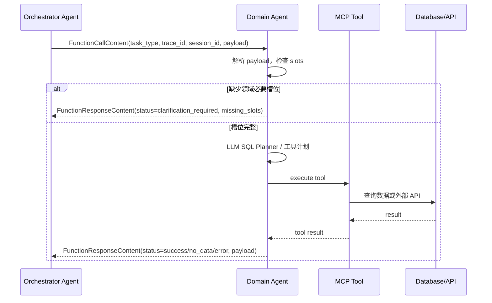

### 9.4 A2A 的价值

- Agent 间通信协议统一，便于增加新 Agent。
- Orchestrator 不需要知道下游具体工具实现。
- 下游 Agent 可以独立测试、独立部署、独立重启。
- trace_id 和 session_id 贯穿链路，便于 debug。

---

## 10. MCP 工具层设计

MCP 服务是 Agent 与数据/API 之间的安全隔离层。

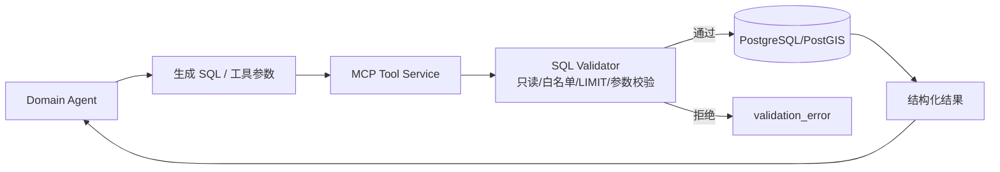

MCP 层主要保障：

- 只允许 `SELECT` / `WITH` 只读 SQL。
- 禁止 `INSERT/UPDATE/DELETE/DROP/ALTER` 等危险操作。
- 禁止 `SELECT *`。
- 每条 SQL 必须有 `LIMIT`。
- 只能访问白名单表。
- 使用参数绑定，避免 SQL 注入。
- 执行失败或校验失败会返回结构化错误，领域 Agent 可重试。

---

## 11. RAG 设计

本项目中的 RAG 主要有三类：

1. Area RAG：把用户提到的区域、地标或别名解析为标准 `area_id`。
2. Transit RAG：把通勤起点、终点、站点名称解析为结构化交通端点。
3. Crime Category RAG：把中文或模糊犯罪类型解析为 NYPD 数据库中的真实 `offense_category`。

### 11.1 Area RAG 流程

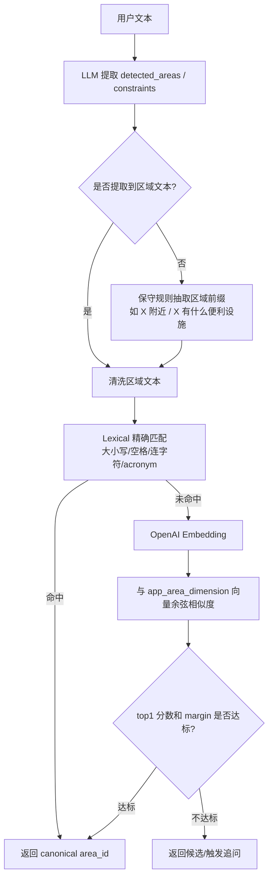

### 11.2 Area RAG 数据来源

RAG 索引来自数据库表 `app_area_dimension`：

| 字段 | 作用 |
|---|---|
| area_id | 标准 NTA ID，例如 MN0101 |
| area_name | 标准区域名，例如 Financial District-Battery Park City |
| borough | Borough 信息，例如 Manhattan |

当前实现是进程内索引：服务启动后从 Postgres 加载区域表，用 embedding 构建内存向量列表。这样对小规模区域解析足够轻量，后续可演进为 pgvector 持久向量库。

### 11.3 RAG 拒识机制

为了避免错误召回，系统设置了阈值：

| 参数 | 含义 |
|---|---|
| top_k | 返回候选数量，默认 5 |
| min_similarity | top1 最小相似度，默认 0.78 |
| min_margin | top1 与 top2 最小差距，默认 0.04 |

只有 top1 足够高且与第二名拉开距离，才会自动解析；否则进入澄清流程。

### 11.4 Crime Category RAG 流程

犯罪问答中有一个特殊问题：用户通常会说中文概念，例如“偷盗”“入室盗窃”“抢劫”“袭击”，但 NYPD 数据库中的字段是英文枚举，例如 `PETIT LARCENY`、`GRAND LARCENY`、`BURGLARY`、`ROBBERY`。如果只让 LLM 按字面生成 SQL，很容易出现漏召回，例如把“偷盗”只写成 `ILIKE '%theft%'`，从而漏掉 `PETIT LARCENY` 和 `GRAND LARCENY`。

因此 Neighborhood Agent 增加了 `crime_category_rag`，在 SQL planner 之前先解析犯罪类别。

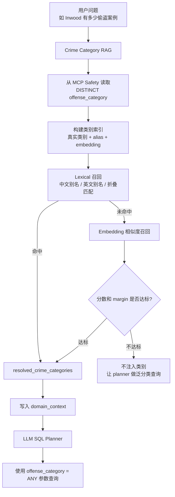

Crime Category RAG 的数据来源不是文档，而是数据库真实枚举：

```sql
SELECT offense_category, COUNT(*) AS incident_count
FROM app_crime_incident_snapshot
WHERE offense_category IS NOT NULL
GROUP BY offense_category
ORDER BY incident_count DESC
LIMIT 50;
```

这样做的关键收益是：LLM 不需要记住所有 NYPD 犯罪分类，也不需要在 prompt 中硬编码大量映射。RAG 先把自然语言犯罪类型解析为数据库中真实存在的类别，再把结果传给 SQL planner。

示例：

| 用户表达 | RAG 召回结果 |
|---|---|
| 偷盗 / 盗窃 / 偷窃 | `PETIT LARCENY`, `GRAND LARCENY`, `OTHER OFFENSES RELATED TO THEFT`, `GRAND LARCENY OF MOTOR VEHICLE` |
| 入室盗窃 | `BURGLARY` |
| 抢劫 | `ROBBERY` |
| 攻击 / 袭击 | `ASSAULT 3 & RELATED OFFENSES`, `FELONY ASSAULT` |

被召回的类别会写入 A2A payload 的 `domain_context`：

```json
{
  "resolved_crime_categories": [
    "PETIT LARCENY",
    "GRAND LARCENY",
    "OTHER OFFENSES RELATED TO THEFT",
    "GRAND LARCENY OF MOTOR VEHICLE"
  ],
  "crime_category_rag_candidates": [
    {
      "offense_category": "PETIT LARCENY",
      "score": 1.0,
      "reason": "alias:偷盗"
    }
  ]
}
```

SQL planner 收到该上下文后，不再自己翻译“偷盗”，而是直接使用 RAG 结果生成参数化 SQL：

```sql
SELECT c.offense_category, COUNT(*) AS crime_count
FROM app_crime_incident_snapshot c
JOIN app_area_dimension d ON d.area_id = c.area_id
WHERE d.area_name ILIKE :target_area_name
  AND c.offense_category = ANY(:resolved_crime_categories)
GROUP BY c.offense_category
ORDER BY crime_count DESC
LIMIT 20;
```

如果用户问的是“有哪些类型的犯罪案例”这类泛分类问题，Crime Category RAG 不会强行注入具体类别，planner 会生成按 `offense_category` 全量聚合的 SQL。

---

## 12. 数据架构

系统数据存储在 PostgreSQL/PostGIS 中，核心表如下：


### 12.1 数据来源

| 数据类型 | 来源 | 用途 |
|---|---|---|
| 区域边界 | NYC NTA / GeoJSON | 区域识别、地图高亮、空间归属 |
| 犯罪数据 | NYPD Complaint Data | 安全问答、犯罪分类统计 |
| 便利设施 | NYC Facilities / Overpass | 公园、学校、图书馆、医疗等 |
| 娱乐设施 | Overpass / OSM | 酒吧、餐厅、影院、剧院等 |
| 租金/房源 | RentCast / HUD / Zillow 类数据 | 租金估计、房源推荐 |
| 交通 | MTA GTFS / GTFS-RT | 通勤和下一班车 |
| 天气 | National Weather Service | 当前/小时级天气 |

### 12.2 数据同步链路

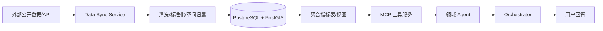

---

## 13. SQL Planner 与安全执行

Housing Agent 和 Neighborhood Agent 支持 Controlled SQL Generation：领域 Agent 可以让 LLM 根据 schema 生成只读 SQL，但 SQL 不会直接执行，必须经过 MCP 校验。

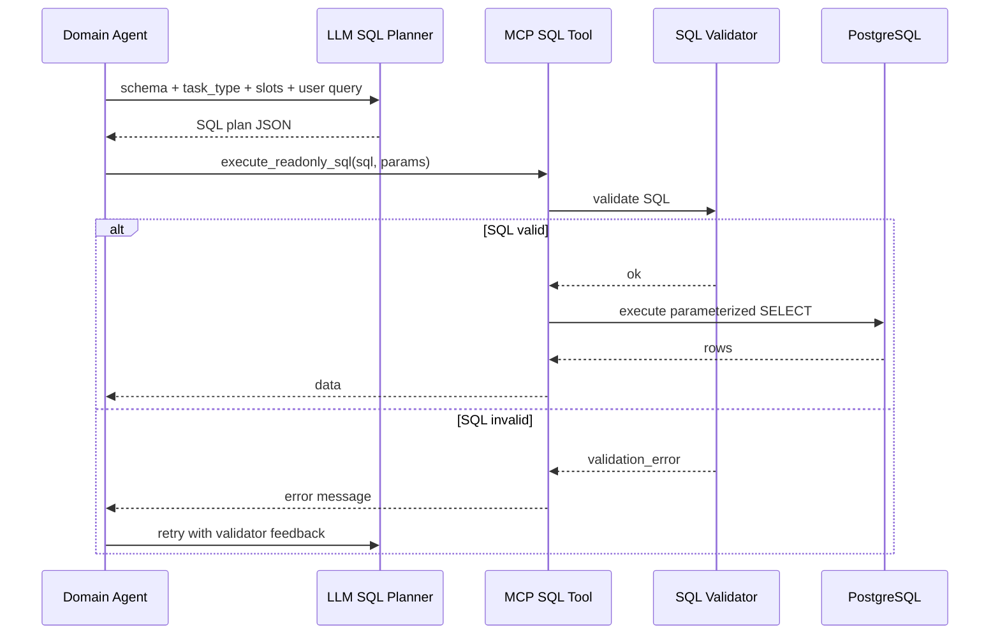

这种方式兼顾灵活性和安全性：

- LLM 可以根据用户问题生成查询计划。
- MCP 保证不会执行危险 SQL。
- SQL 失败时，Agent 可以把错误反馈给 LLM 重试。
- 数据库访问权限集中在 MCP 层，不暴露给 Orchestrator。

---

## 14. 会话记忆与 Profile

系统同时使用两类状态：

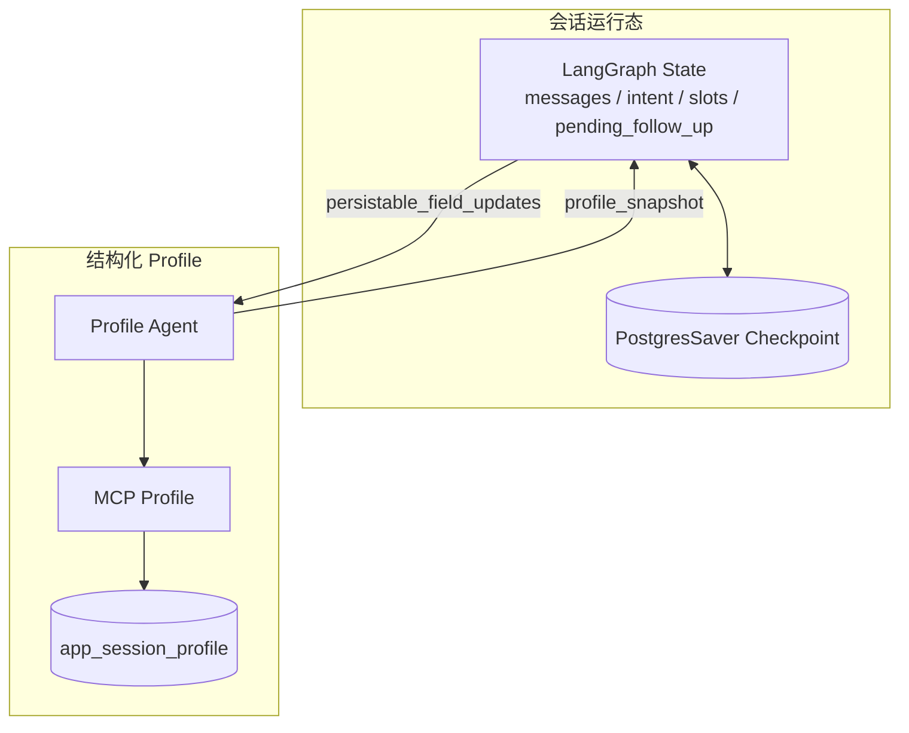

| 状态 | 存储 | 作用 |
|---|---|---|
| LangGraph State | LangGraph checkpoint | 多轮对话中的工作记忆，例如当前 intent、pending follow-up |
| Profile Snapshot | app_session_profile | 结构化用户画像，例如 target_area、budget、bedroom_type、weights |

示例：用户先设置“我想看华尔街附近”，之后再问“那便利设施呢？”，系统会从 profile 回填 `target_area_id`，无需用户重复说区域。

---

## 15. 关键业务流程示例

### 15.1 便利设施查询

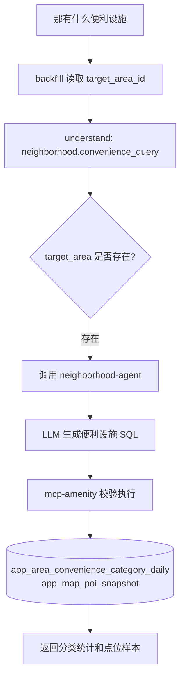

### 15.2 犯罪查询

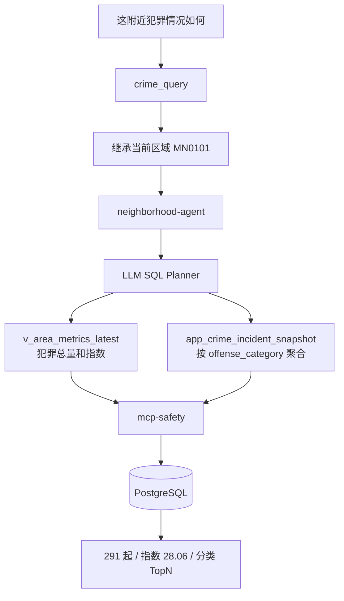

### 15.3 区域缺槽追问

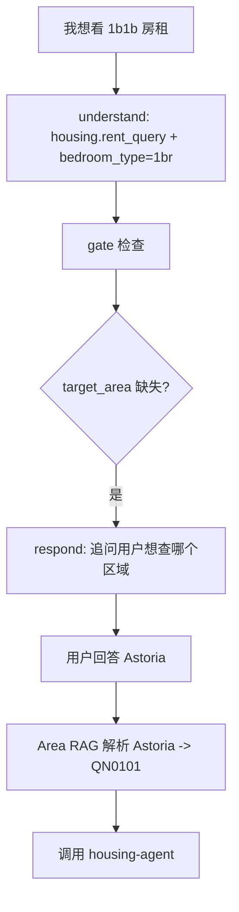

---

## 16. 可观测性与调试

系统支持多层调试：

| 调试点 | 作用 |
|---|---|
| Docker healthcheck | 检查服务是否启动成功 |
| `/health` / `/ready` | 检查单服务和依赖状态 |
| Chat debug payload | 查看 intent、agent_results、SQL plan、sources |
| trace_id | 串联一次请求中的多个 Agent 调用 |
| LangSmith 可选 | 观察 LangGraph 节点、LLM 调用耗时和 token |
| 单元/集成测试 | 覆盖 RAG、SQL validator、planner fallback、端到端流程 |

示例 debug 信息可以看到：

- `intent_detected`
- `agent_results`
- `sql_plan`
- `profile_snapshot`
- `sources`
- `missing_slots`


---

## 17. 项目亮点

### 17.1 多 Agent 架构清晰

项目不是单体 LLM 应用，而是将不同领域能力拆成独立 Agent，并通过 Orchestrator 统一调度。

### 17.2 LangGraph 状态机编排

Orchestrator 使用 LangGraph 节点流，显式管理理解、持久化、缺槽、执行、观察、回答等阶段。

### 17.3 A2A + MCP 双层解耦

- A2A 解耦 Agent 与 Agent。
- MCP 解耦 Agent 与数据/API。
- SQL 校验放在工具层，降低 LLM 直接访问数据库的风险。

双层解耦的核心思想是：**Orchestrator 不关心领域 Agent 内部怎么查数据，领域 Agent 也不直接绑定数据库或外部 API 的具体实现**。系统把“任务分发”和“工具执行”拆成两层稳定接口。

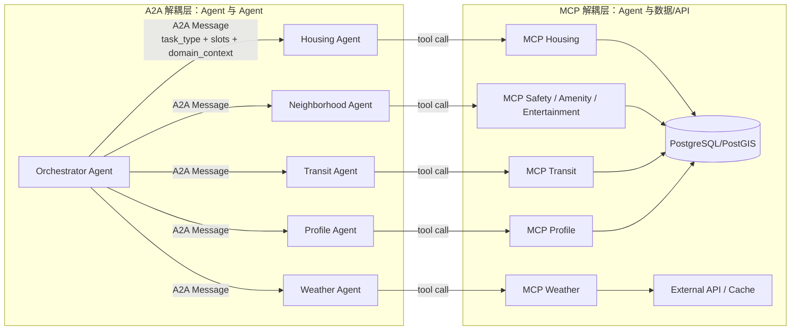

#### 17.3.1 A2A 如何解耦 Agent 与 Agent

A2A 层只规定 Agent 之间传递什么任务和返回什么状态，不要求调用方了解被调用方内部实现。

实现方式：

- Orchestrator 调用领域 Agent 时，只构造标准 A2A request。
- request 中包含 `task_type`、`trace_id`、`session_id`、`source_agent`、`target_agent` 和业务 `payload`。
- `payload` 只传当前任务需要的最小信息，例如 `domain_user_query`、`slots`、`domain_context`。
- 领域 Agent 执行后返回标准 A2A response。
- response 通过 `status` 表达执行结果，例如 `success`、`no_data`、`clarification_required`、`dependency_failed`。

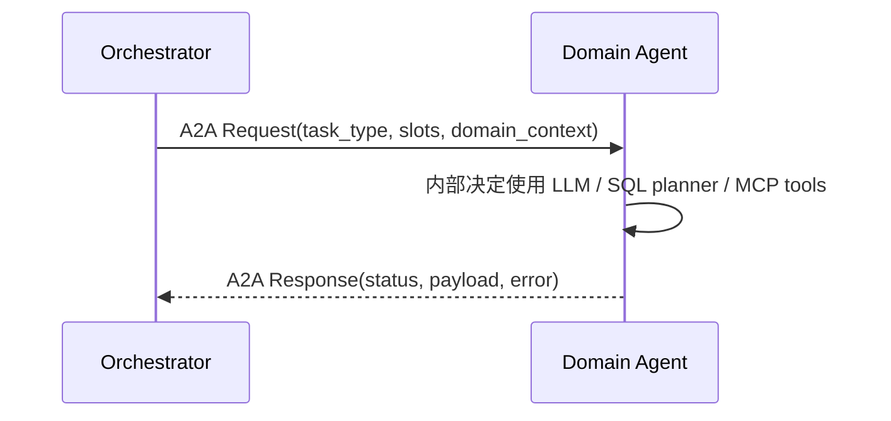

因此新增或替换领域 Agent 时，只要保持 A2A 契约不变，Orchestrator 不需要修改内部业务逻辑。例如未来把 `neighborhood-agent` 拆成 `safety-agent`、`amenity-agent`、`entertainment-agent`，Orchestrator 只需要更新路由目标和 `task_type` 映射，不需要关心每个 Agent 内部如何查询数据库。

A2A 解耦带来的工程收益：

| 解耦点 | 说明 |
|---|---|
| 调用协议稳定 | Agent 之间只依赖 `task_type + payload + status` |
| 职责边界清晰 | Orchestrator 负责调度，Domain Agent 负责领域执行 |
| 易于替换 | 替换某个 Agent 不影响其他 Agent |
| 易于测试 | 可以单独 mock 某个 Agent 的 A2A response |
| 易于扩展 | 新增 Agent 只需注册新的路由和任务类型 |

#### 17.3.2 MCP 如何解耦 Agent 与数据/API

MCP 层只规定工具如何被调用，不让 Agent 直接绑定数据库连接、SQL 执行细节或外部 API 细节。

实现方式：

- 领域 Agent 生成查询计划或工具参数。
- Agent 不直接连接 PostgreSQL，也不直接访问外部 API。
- Agent 调用对应 MCP 服务，例如 `mcp-safety`、`mcp-housing`、`mcp-weather`。
- MCP 服务内部负责 SQL 白名单校验、参数绑定、执行查询、调用外部 API、缓存等。
- MCP 将结果以结构化 JSON 返回给领域 Agent。

```mermaid
sequenceDiagram
    participant A as Domain Agent
    participant M as MCP Tool Service
    participant V as SQL/API Guardrail
    participant D as Database or External API

    A->>M: Tool Request(sql/params or api args)
    M->>V: validate readonly SQL / allowed tables / params
    alt 校验通过
        V-->>M: ok
        M->>D: execute query or API request
        D-->>M: raw result
        M-->>A: structured result
    else 校验失败
        V-->>M: validation_error
        M-->>A: structured error
    end
```

MCP 解耦带来的工程收益：

| 解耦点 | 说明 |
|---|---|
| 数据访问隔离 | Agent 不直接持有数据库执行能力 |
| 安全边界清晰 | SQL 校验、白名单表、LIMIT、只读限制都在 MCP 层 |
| 数据源可替换 | 数据库连接、外部 API、缓存和 SQL 执行策略变化时，优先改 MCP；如果对 Agent 暴露的 schema contract 变化，则需要同步更新领域 Agent 的 schema prompt / planner contract |
| 工具可复用 | 多个 Agent 可以复用同一个 MCP 工具服务 |
| 错误结构化 | MCP 返回 `validation_error`、`execution_error`，Agent 可据此重试或降级 |

#### 17.3.3 两层解耦组合后的调用边界

```mermaid
flowchart TD
    U[用户问题] --> O[Orchestrator Agent]
    O -->|A2A: 我要查犯罪| N[Neighborhood Agent]
    N -->|MCP: 执行只读 SQL| S[MCP Safety]
    S -->|受控访问| DB[(PostgreSQL)]
    DB --> S
    S --> N
    N -->|A2A Response: status + result| O
    O --> R[最终回答]
```

这条链路里每一层只知道下一层的稳定接口：

- Orchestrator 只知道调用哪个 Agent，不知道 SQL 怎么写。
- Neighborhood Agent 只知道调用哪个 MCP，不直接操作数据库连接。
- MCP Safety 只知道执行受控只读 SQL，不参与自然语言理解和回答生成。
- PostgreSQL 只作为数据存储，不暴露给 LLM 或 Orchestrator。

因此系统同时获得了可扩展性和安全性：上层可以灵活增加 Agent，下层可以替换数据源或增强校验，而不会形成强耦合。

### 17.4 RAG 用于结构化系统中的实体解析

RAG 不只是文档问答，而是用于将自然语言区域表达映射到数据库主键，使后续结构化查询可执行。

### 17.5 数据可解释

回答不只给自然语言，还能追溯到：

- 使用了哪个 Agent。
- 使用了哪个 MCP 工具。
- 查询了哪些表。
- 使用了哪些数据窗口。
- 数据来自哪个 source_snapshot。

---

## 18. 当前限制与改进方向

| 当前限制 | 影响 | 改进方向 |
|---|---|---|
| Area RAG 是进程内索引 | 重启后需重新加载 embedding | 迁移到 pgvector 持久向量库 |
| SQL planner 依赖 prompt 约束 | LLM 可能生成不理想 SQL | 增加 planner guardrail 和更多测试样例 |
| 前端地图展示依赖缓存图层 | 图层数据需要预生成 | 增加按需图层生成和缓存失效策略 |

---

## 19. 总结

NYC Agent 是一个结合多 Agent、LangGraph、A2A、MCP、RAG 和结构化城市数据的智能居住决策系统。它的核心价值在于：

- 用 Agent 编排自然语言任务。
- 用 RAG 解决实体解析问题。
- 用 MCP 工具服务安全访问数据库和外部 API。
- 用 PostgreSQL/PostGIS 管理真实城市数据。
- 用 LangGraph 实现可追踪、可维护、可扩展的多轮对话流程。

相比普通 LLM Chatbot，该系统更接近真实工程中的 AI Agent 应用：LLM 不直接“凭空回答”，而是在受控流程中选择 Agent、调用工具、查询数据、聚合结果并解释给用户。

